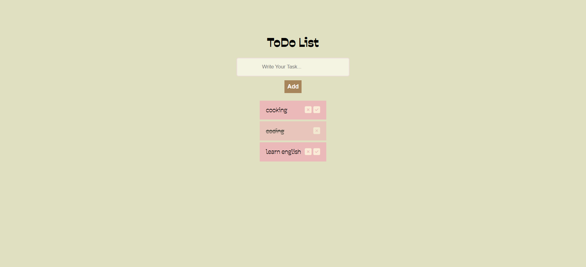

# 📝 ToDo App

A simple and engaging project for managing tasks using HTML, CSS, JavaScript, and React.  
Each task can be added, deleted, and marked as completed.

---

## 🖼️ Preview

---

## 📦 Features

- ✅ Responsive design  
- 🎨 Modern and clean UI  
- ✔ Add, delete, and mark tasks as completed  
- 💡 Clean and readable HTML/CSS structure  
- ✔ Built with React  

---

## 🚀 Live Demo

[View Demo on GitHub Pages](https://yektaakhavan.github.io/react-ToDoApp/)

---

## 🛠️ Built With

- HTML5  
- CSS3  
- JavaScript  
- React  

---

## 👤 Developer

💻 Created by Yekta Akhavan

---

## 🙏 Acknowledgments

If you find this project useful, please consider giving it a ⭐ on GitHub to support me.
